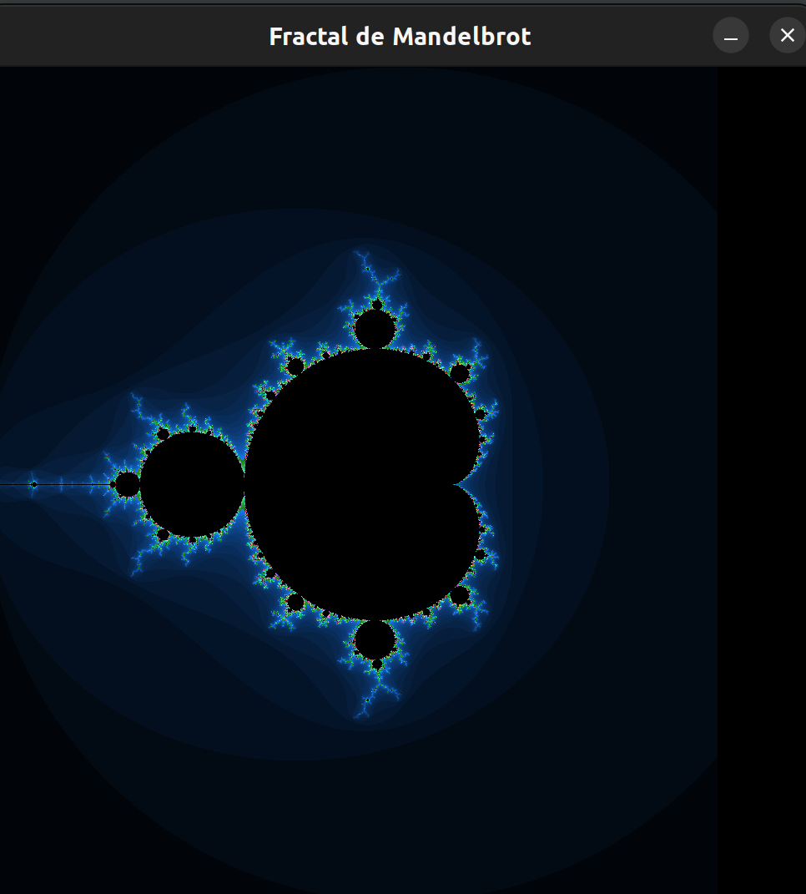

# Renderizador de Fractal Mandelbrot

Este projeto é um renderizador de fractal Mandelbrot multithreaded escrito em C usando a biblioteca SDL2.

## Recursos

- Renderiza o conjunto de Mandelbrot como uma imagem fractal.
- Usa várias threads para acelerar o processo de renderização.
- Mapeia coordenadas de tela para o plano complexo para geração de fractal.
- Usa SDL2 para renderização gráfica.

## Como funciona

O conjunto de Mandelbrot é um conjunto de números complexos que, quando aplicado a uma função iterativa, não diverge. Este projeto renderiza esse conjunto como uma imagem fractal.

Para acelerar o processo de renderização, o programa usa várias threads. Cada thread é responsável por renderizar uma parte do fractal de Mandelbrot.

Para garantir o acesso seguro ao renderer durante a renderização, o programa usa um mutex. Isso evita que duas threads tentem acessar o renderer ao mesmo tempo, o que poderia causar problemas.

A cor de cada pixel na imagem é determinada pelo número de iterações que levou para o ponto correspondente no conjunto de Mandelbrot divergir. Isso cria o efeito de cores vibrantes que é típico das imagens do conjunto de Mandelbrot.

O programa mapeia as coordenadas de tela para o plano complexo para gerar o fractal. Isso permite que o programa transforme a posição de um pixel na tela em um número complexo que pode ser usado para calcular o conjunto de Mandelbrot.

Finalmente, o programa divide o bloco de renderização entre as threads. Cada thread é responsável por renderizar uma parte do bloco, o que permite que o programa tire proveito de múltiplos núcleos de CPU para acelerar a renderização.

## Estrutura do Código

Os principais componentes do código são:

- `map_to_complex`: Esta função mapeia coordenadas de tela para o plano complexo.
- `mandelbrot`: Esta função calcula o conjunto de Mandelbrot para um determinado número complexo.
- `get_color`: Esta função determina a cor de um pixel com base no número de iterações.
- `render_mandelbrot_part`: Esta função é responsável por renderizar uma parte do fractal de Mandelbrot.
- `main`: Esta função inicializa o SDL, cria threads para renderização e lida com o loop de eventos principal.

## Construção e Execução

Este projeto requer a biblioteca SDL2. Se você estiver usando um gerenciador de pacotes como `apt` no Ubuntu, você pode instalar o SDL2 com o seguinte comando:

```bash
sudo apt-get install libsdl2-dev
```

Após instalar o SDL2, você pode compilar o projeto usando um compilador C. Por exemplo, usando gcc:

```bash
gcc mandelbrot.c -o mandelbrot -lSDL2 -lm
```

Então, você pode executar o programa com:

```bash
./mandelbrot
```

### Exemplo de Imagem Gerada


Autores:
```
Jayme Riegel e Chrystian Rocha
```
